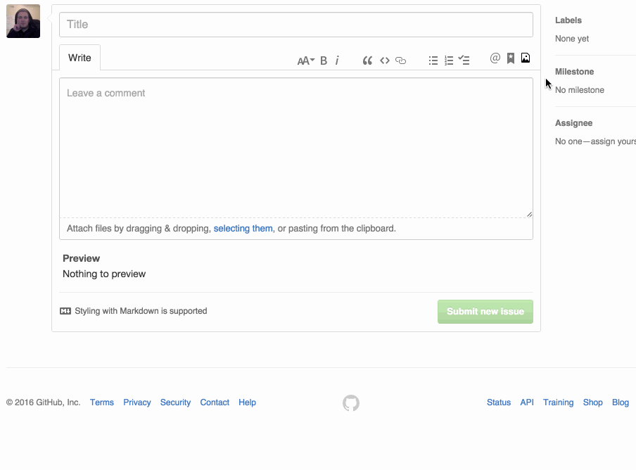

# GifHub

A Chrome extension that adds a button on GitHub comment toolbars, allowing you to search for (and include) GIFs in comments. Many thanks to [Giphy](http://giphy.com/), as this uses their API.

# Install

- [Chrome](https://chrome.google.com/webstore/detail/gifhub/lponagpckglibniamicamklhfkoebpeb/)

# Installing for Development

1. Clone the repository
2. Run `npm install` in the root of the project
3. Run `npm run build-chrome`
4. Visit the [extensions page](chrome://extensions) in Chrome
5. Enable the `Developer Mode` checkbox
6. Click `Load unpacked extension`
7. Select the `dist/chrome` directory of this project (generated in Step 3)

# Issues?

You can submit any issues you have [here](https://github.com/DrewML/GifHub/issues/new)
